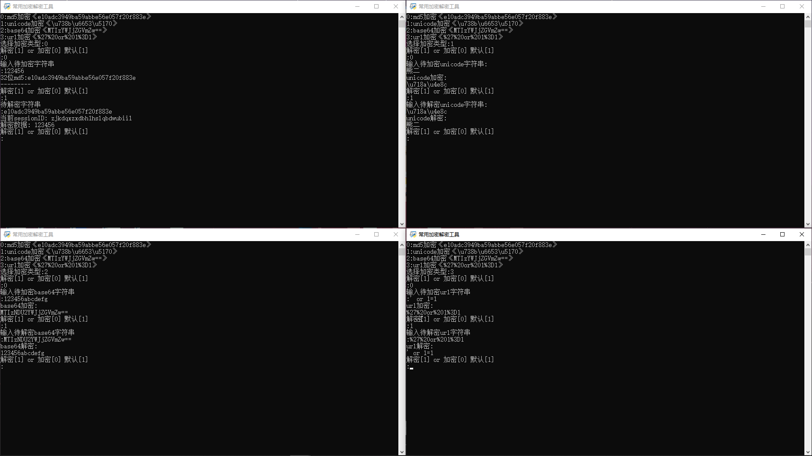

# Decryption Toolbox

简介:支持4种常用加密，包括 MD5、Unicode、Base64 和 URL 的加密解密

- md5加密(cmd5接口)
- Unicode(本地)
- Base64(本地)
- URL(本地)

引用库

```
import requests
import re
import base64
import urllib.parse
import hashlib
import os
```

用法

```
┌──(root㉿kali)-[/Decryption_Toolbox]
└─# python 加密解密v2.0.py 


                       _ooOoo_
                      o8888888o
                      88" * "88
                      (| -_- |)
                      O\  =  /O
                   ____/`---'\____
                 .'  \\|     |//  `.
                /  \\|||  :  |||//  \
               /  _||||| -:- |||||-  \
               |   | \\\  -  /// |   |
               | \_|  ''\---/''  |   |
               \  .-\__  `-`  ___/-. /
             ___`. .'  /--.--\  `. . __
          ."" '<  `.___\_<|>_/___.'  >'"".
         | | :  `- \`.;`\ _ /`;.`/ - ` : | |
         \  \ `-.   \_ __\ /__ _/   .-` /  /
    ======`-.____`-.___\_____/___.-`____.-'======
                       `=---='
    ^^^^^^^^^^^^^^^^^^^^^^^^^^^^^^^^^^^^^^^^^^^^^
                佛祖保佑       永无Bug
    Author:zeddm
    Start_time:2025|2|9  v2.0
    
0:md5加密《e10adc3949ba59abbe56e057f20f883e》
1:unicode加密《\u738b\u6653\u5170》
2:base64加密《MTIzYWJjZGVmZw==》
3:url加密《%27%20or%201%3D1》
选择加密类型:

```

演示：


